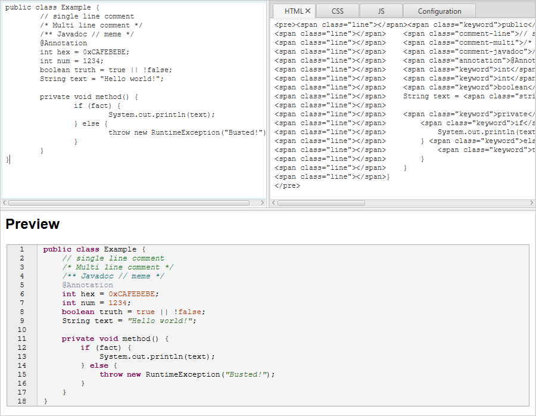
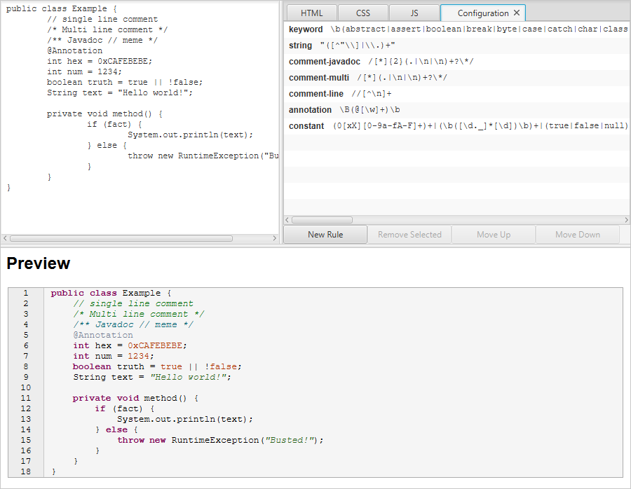

# Java2HTML

A JavaFX app for converting Java _(Or a user specified language)_ to HTML. Paste source code into the top-left panel and the HTML will show in the top-right, with a preview at the bottom.
The CSS and _optional JS_ are available in the other tabs in the top-right. Updating the CSS and JS will display live updates in the preview area.

### Top-Left tabs:

* **HTML**: The HTML output.
* **CSS**: The CSS code that styles the HTML span tags.
* **JS**: Optional JS for manual inclusion of collapse-sections.
* **Patterns**: List of Regex groups for the currently loaded language. 

While the JS is not necessary it allows you to make portions of the code collapseable.

## Download

See the [releases](https://github.com/Col-E/Java2HTML/releases) page for the latest build. Or compile with maven via `mvn package`

## Screenshots

* 
* 

## Libraries used:

* [Apache Commons IO](https://commons.apache.org/proper/commons-io/)
* [Apache Commons Text](https://commons.apache.org/proper/commons-text/)
* [ControlsFX](https://github.com/controlsfx/controlsfx)
* [JRegex](http://jregex.sourceforge.net/)
* [picocli](https://picocli.info/)
* [Lombok](https://projectlombok.org/)