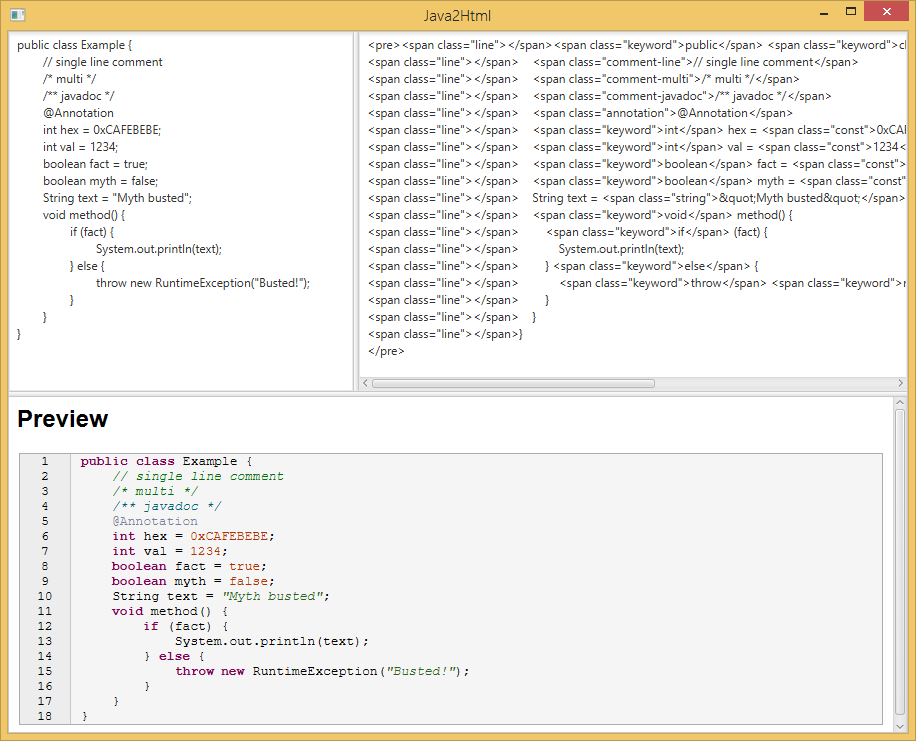

# Java2HTML

JavaFX app for converting java to HTML. Paste source code into the top-left panel and the HTML will show in the top-right, with a preview at the bottom.
Make sure to include the CSS/JS includes in the directory `src/main/resources/`

The JS is not necessary however it allows you to make portions of the code collapseable. For examples see [here](https://col-e.github.io/Recaf/plugins-ex-mwscan.html). 

### Download

See the [releases](https://github.com/Col-E/Java2HTML/releases) page for the latest build. Or you could compile with maven via `mvn package`

### Screenshots

### Libraries used:

* [Apache Commons Text](https://commons.apache.org/proper/commons-text/)